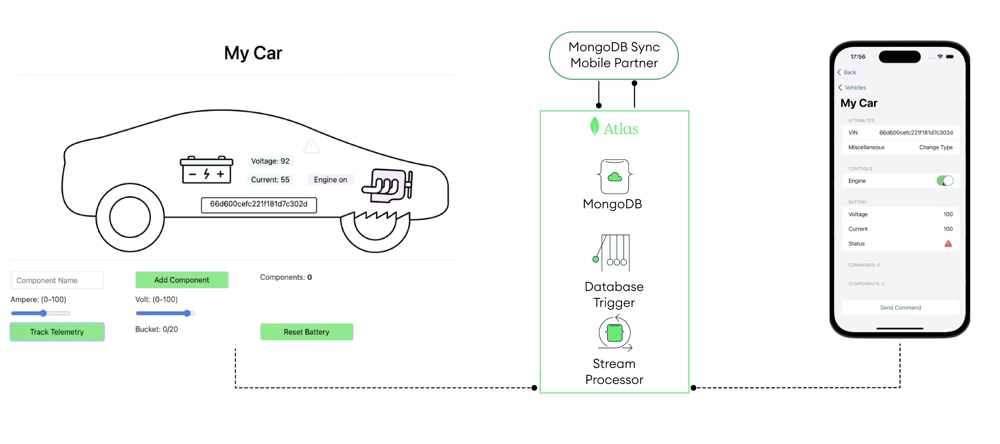

# Vehicle Digital Twin Set Up with MongoDB, Ditto & AWS  

<!-- TABLE OF CONTENTS -->

  
Table of Contents

  <ol>
    <li><a href="#part-1-set-up-the-mongodb-atlas-digital-twin-backend">Set up the MongoDB Atlas Digital-Twin Backend</a></li>
    <li><a href="#part-2-set-up-the-typescript-vehicle-simulator">Typescript Vehicle Simulator</a></li>
    <li><a href="#part-3-set-up-the-ios-swift-vehicle-controller-mobile-application">iOS Swift Vehicle Controller Mobile Application </a></li>
    <li><a href="#part-4-set-up-the-amazon-sagemaker-integration">SageMaker Integration</a></li>
    <li><a href="#step-by-step-demonstration">Demonstration Step by Step</a></li>
    </ol>

A connected vehicle platform opens a window of analytical data that manufacturers can use to provide recommendations for safer, more efficient and improved driving experiences. Personalized driving experiences are made possible through bidirectional information exchange between applications in the car, mobile, webapps and machine learning interfaces in the cloud.

However, creating such a cutting edge connected vehicle platform requires the best-in-class foundation. With MongoDB Atlas, AWS ecosystem and Ditto's Big Peer syncing with Mobile Apps & the connected vehicle, you are provided with such building blocks. MongoDB is your end-to-end data layer for efficient bidirectional data exchange, ensuring consistency on a mobile device, vehicle, and the cloud. AWS, including SageMaker and its integration capabilities, is your public cloud infrastructure allowing you to gain value out of your data and produce the right recommendations for enhanced driving experiences. As for Ditto, it performs as a trusted peer in the distributed peer-to-peer network, allowed by its platform and the "Big Peer" enabling the sync engine in this by being splited in many different nodes (physical or virtual), making this the game-changer tool for an efficient syncing between your MongoDB data consistency and offline updates that can be performed with Ditto inside the AWS environment.

Under the hood we use a mix of MongoDB and AWS components nicely put together to create this end to end scenario. If you are curious and want to learn how it works you can jump directly to the [demo section](https://github.com/mongodb-industry-solutions/Vehicle-Digital-Twin-Feedback-Loop/blob/feature/ReadMe/Demo_Instructions.md). 

With these tools in mind, let’s begin creating a cutting edge connected vehicle platform!

# Set Up Instructions 

## Part 1: Set up the MongoDB Atlas Digital-Twin Backend

[Set up the MongoDB Atlas Digital-Twin Backend](https://github.com/mongodb-industry-solutions/Vehicle-Digital-Twin-Feedback-Loop/tree/feature/ReadMe/atlas-backend)

## Part 2: Set up the Typescript Vehicle Simulator

[Set up the Typescript Vehicle Simulator](https://github.com/mongodb-industry-solutions/Vehicle-Digital-Twin-Feedback-Loop/tree/feature/ReadMe/vehicle-ts)

## Part 3: Set up the iOS Swift Vehicle Controller Mobile Application

[Set up the iOS Swift Vehicle Controller Mobile Application](https://github.com/mongodb-industry-solutions/Digital-Twin-AWS-Blog/tree/feature/ReadMe/mobile-swift)

## Part 4: Set up the Amazon SageMaker Integration

[Set up the Amazon SageMaker Integration](https://github.com/mongodb-industry-solutions/Digital-Twin-AWS-Blog/tree/feature/ReadMe/aws-sagemaker)

# Step by Step Demonstration
[Step by Step Demonstration: Telemetry Feedback Loop Use Case](https://github.com/mongodb-industry-solutions/Vehicle-Digital-Twin-Feedback-Loop/blob/feature/ReadMe/Demo_Instructions.md)
